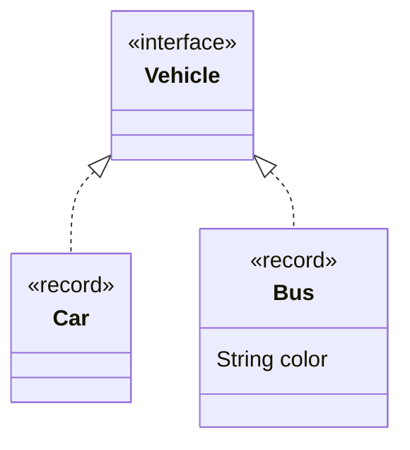
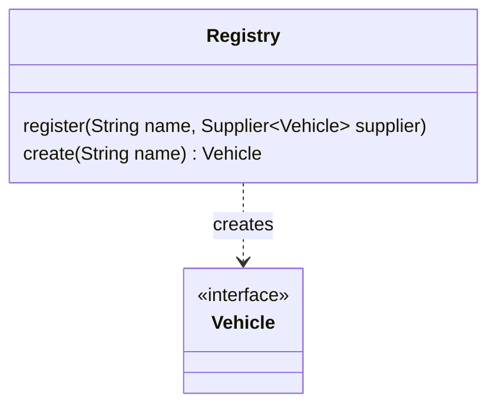

# Abstract Factory

Let say we have a simple hierarchy of classes, with a `Bus` and a `Car` both implementing an interface `Vehicle`.

```java
interface Vehicle { }
record Bus(String color) implements Vehicle { }
record Car() implements Vehicle { }
```



## Static abstract factory

And we want to create a `Vehicle` from a string, "bus" for a `Bus` and "car" for a `Car`,
one simple solution is to use a switch on the string

```java
sealed interface Vehicle permits Bux, Car {
  static Vehicle create(String name) {
    return switch(name) {
      case "bus" -> new Bus("yellow");
      case "car" -> new Car();
      default -> throw new IllegalArgumentException("unknown " + name);
    };
  }
}
record Bus() implements Vehicle { }
record Car() implements Vehicle { }
```

The usage is the following
```java
Vehicle vehicle = Vehicle.create("bus");
System.out.println(vehicle);  // it's a Bus
```

The main issue of this design is that it only works with closed hierarchy (the interface is declared `sealed`).
A user of the interface `Vehicle` can not add a new subtype because all possible classes are handwritten
in the `switch`.

We can also remark that passing parameters to the creation is not easy, here, we can only create yellow bus. 

An abstract factory abstracts over the concept of [factory](../factory) and
allows creating instances of an open hierarchy classes from parameters.


## Dynamic abstract factory

A dynamic abstract factory is an abstract factory (also called a **Registry**) that let you register
[factory](../factory) for a value (here a String) and then calls the factory for that value.
It uses a hashtable/dictionary (a `HashMap) to associate the value to a factory (here a `Supplier`).

```java
public class Registry {
  private final HashMap<String, Supplier<? extends Vehicle>> map = new HashMap<>();
    
  public void register(String name, Supplier<? extends Vehicle> supplier) {
    map.put(name, supplier);
  }

  public Vehicle create(String name) {
    return map.computeIfAbsent(name, n -> { throw new IllegalArgumentException("Unknown " + n); })
        .get();
  }
}
```



The registry is first setup using the method `register` to adds the association, then the method `create()`
can be called with a value.

```java
var registry = new Registry();
registry.register("car", Car::new);
registry.register("bus", () -> new Bus("yellow"));
    
var vehicle = registry.create("bus");
System.out.println(vehicle1);  // it's a Bus
```

Because the registry contains dynamic associations, a user that creates a new kind of `Vehicle`
can register it into the regitry too.

This design is also flexible in terms of object creation, it's quite easy to register an instance
(here `yellowBus`) to always been returned playing the same role as a
[singleton pattern](https://en.wikipedia.org/wiki/Singleton_pattern)
without the drawbacks of a singleton: you can test it, it's not a global property,
it's access is tied to the access or the registry.

```java
var registry = new Registry();

// as a singleton
var yellowBus = new Bus("yellow");
registry.register("bus", () -> yellowBus);
```

This design is the basis of the [inversion of control](https://en.wikipedia.org/wiki/Inversion_of_control)
and its most popular incarnation the [dependency injection](https://en.wikipedia.org/wiki/Dependency_injection).

The registry can also be separated in two parts because all methods should be called first before calling
the method `create` using the [builder pattern](../builder), you can find an example of such transformation
in the [command pattern](../command) repository.