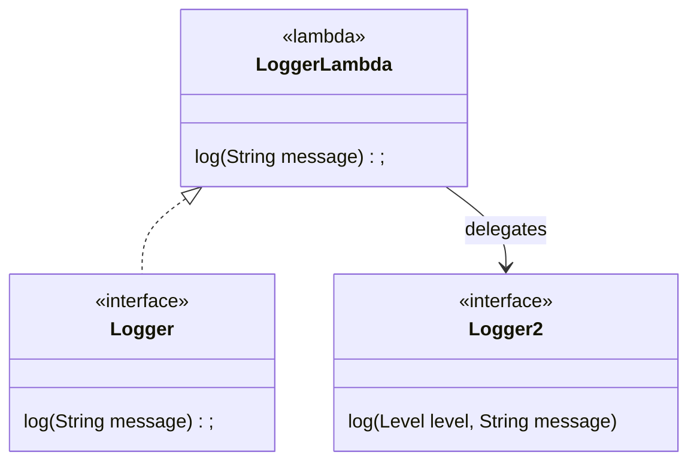

# Adapter Pattern

Let's say we have a simple interface like a `Logger`

```java
interface Logger {
  void log(String message);
}
```

and we have an existing API that takes a `Logger`
```java
public static void sayHello(Logger logger) {
  logger.log("hello");
}
```

Now, we introduce another logging API named `Logger2`, perhaps from another library
```java
enum Level { WARNING, ERROR }

interface Logger2 {
  void log(Level level, String message);
}
```

and we want to use that new interface `Logger2` with the method `sayHello()`.
Obviously, we can not directly call `sayHello` with a `Logger2`, we need to do adaptation work.

## Adapter when we do not control Logger2

A `Logger2` is a Logger with a supplementary `Level` so adapting a `Logger2` to be a `Logger` necessitate a level.

```java
public static Logger adapt(Logger2 logger2, Level level) {
  return msg -> logger2.log(level, msg);
}
```

And we can use the method `adapt()` like this
```java
Logger logger = adapt(logger2, Level.WARNING);
logger.log("abort abort !");
```

An adapter acts a vue that transfers the data from one method of the new interface
to a method call to the old interface.

## Adapter when we control Logger2

If we control `Logger2`, the method `adapt()` can be an instance method of `Logger2`
```java
interface Logger2 {
  void log(Level level, String message);

  default Logger adapt(Level level) {
    return msg -> log(level, msg);
  }
}
```

In terms of UML diagram, the lambda inside adapt acts as an implementation of `Logger`
that delegates its implementation to `Logger2`



and we can call `adapt()` directly on an instance of `Logger2`
```java
Logger logger = logger2.adapt(Level.WARNING);
logger.log("abort abort !");
```
