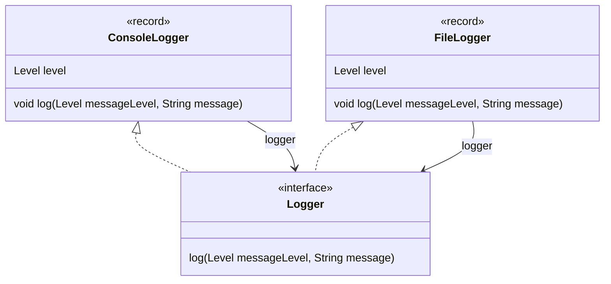

# Chain of Responsibility Pattern

A chain of responsibility is a linked list of action that each take care of a part of a message/request.

Let say we have a `Logger` with 3 `Level` of error message.
```java
enum Level {
  INFO, WARNING, ERROR
}
interface Logger {
  void log(Level messageLevel, String message);
}
```

Now, supose that we want to write a `Logger` that log the message on the console.
The idea of the chain of responsibility is not only do the work specific of the `Logger`
(logging to the console) but also to delegate the work to the next `Logger` in the chain if it exists.
```java
record ConsoleLogger(Level level, Logger logger) implements Logger {
  @Override
  public void log(Level messageLevel, String message) {
    if (messageLevel.compareTo(level) >= 0) {
      System.out.println("log on console: " + message);
    }
    if (logger != null) {
      logger.log(messageLevel, message);
    }
  }
}
```

Using the same pattern, we can implement a `Logger` that log the error message on a file
```java
record FileLogger(Level level, Logger logger) implements Logger {
  @Override
  public void log(Level messageLevel, String message) {
    if (messageLevel.compareTo(level) >= 0) {
      System.out.println("log on file: " + message);
    }
    if (logger != null) {
      logger.log(messageLevel, message);
    }
  }
}
```



And use the different loggers by creating a linked list of loggers
```java
static void main(String[] args) {
  var logger = new FileLogger(Level.WARNING, new ConsoleLogger(Level.INFO, null));
  logger.log(Level.ERROR, "database connection error");
  logger.log(Level.INFO, "listen on port 7777");
}
```


## use delegation to share behavior

We can de-structure a bit the pattern by recognizing the checking the message level again the logger level
and delegating to another logger operation can be written only once.

In that case, the console logger and the file logger are just lambdas
```java
interface Logger {
  void log(Level messageLevel, String message);

  static Logger console() {
    return (messageLevel, message) -> System.out.println("log on console: " + message);
  }

  static Logger file() {
    return (messageLevel, message) -> System.out.println("log on file: " + message);
  }
  ...
```

and add a [decorator](../decorator) that filter the message depending on the message level

```java
  ...
  default Logger withLevel(Level level) {
    return (messageLevel, message) -> {
      if (messageLevel.compareTo(level) >= 0) {
        log(messageLevel, message);
      }
    };
  }
```

and add another [decorator](../decorator) that delegate the logging of a message to another logger
```java
  
  default Logger withLogger(Logger logger) {
    return (messageLevel, message) -> {
      log(messageLevel, message);
      logger.log(messageLevel, message);
    };
  }
}
```

Now creating the different logger is done by composing the different loggers 
```java
static void main(String[] args) {
  var logger = Logger.file().withLevel(Level.WARNING)
      .withLogger(Logger.console().withLevel(Level.INFO));
  logger.log(Level.ERROR, "database connection error");
  logger.log(Level.INFO, "listen on port 7777");
}
```
