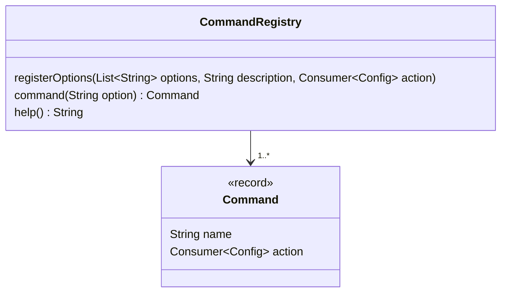

# Command Pattern

A command pattern is the idea to consider an action as an object, so it can be as simple as
using a Runnable or a Consumer.

Let's say we have a configuration with several options that can be activated or not
depending on the options on the command line, for example, if the option "--long" is present
on the command line, the field "longForm" of the configuration should be true.

```java
class Config {
  boolean showHidden = false;
  boolean longForm = false;
  boolean showInode = false;
  boolean showHelp = false;

  @Override
  public String toString() {
    return "Config[showHidden: %s, longForm: %s, showInode: %s, showHelp: %s]"
        .formatted(showHidden, longForm, showInode, showHelp);
  }
}
```

If we suppose that there is a method `config` that takes a list of arguments and returns a configuration  object,
the `main`should be something like this

```java
var config = config(List.of(args));
System.out.println(config);
if (config.showHelp) {
  System.out.println("""
      --all, -a: show hidden files
      --long, -l: long form
      --inode, -i: show inodes
      --help, -h: show this help
      """);
}
```

A straw-man implementation of the method config can be this one
```java
static Config config(List<String> args) {
  var config = new Config();
  for(var arg: args) {
    switch (arg) {
      case "-a", "--all" -> {
        if (config.showHidden) {
          throw new IllegalStateException("--all specified twice");
        }
        config.showHidden = true;
      }
      case "-l", "--long" -> {
        if (config.longForm) {
          throw new IllegalStateException("--long specified twice");
        }
        config.longForm = true;
      }
      case "-i", "--inode" -> {
        if (config.showInode) {
          throw new IllegalStateException("--inode specified twice");
        }
        config.showInode = true;
      }
      case "-h", "--help" -> {
        if (config.showHelp) {
          throw new IllegalStateException("--help specified twice");
        }
        config.showHelp = true;
      }
      default -> {}  // ignore
    }
  }
  return config;
}
```

This implementation is not clean, there is a lot of redundancy in the way having twice the same options
is handled and if we want to add a new option we also to not forget to update the help description of the `main`.

## Enter the command pattern

The idea is to see an action, here changing on field of the configuration from false to true
as an object. Here, our record `Command` also store a `name` to be used to detect if several options
correspond to the same command on the command line.



The `CommandRegitry` store the association between an option as a String and the corresponding `Command`
and also the help description.

```java
record Command(String name, Consumer<Config> action) {}

class CommandRegistry {
  private final HashMap<String, Command> map = new HashMap<>();
  private final StringBuilder help = new StringBuilder();

  public void registerOptions(List<String> options, String description, Consumer<Config> action) {
    var command = new Command(options.get(0), action);
    options.forEach(option -> map.put(option, command));
    help.append(String.join(", ", options)).append(": ").append(description).append("\n");
  }

  public Command command(String option) {
    return map.get(option);
  }

  public String help() {
    return help.toString();
  }
}
```

We need a method to configure the `CommandRegistry` i.e. register all the commands with their options
```java
static CommandRegistry commandRegistry() {
  var registry = new CommandRegistry();
  registry.registerOptions(List.of("--all", "-a"), "show hidden files", c -> c.showHidden = true);
  registry.registerOptions(List.of("--long", "-l"), "long form", c -> c.longForm = true);
  registry.registerOptions(List.of("--inode", "-i"), "show inodes", c -> c.showInode = true);
  registry.registerOptions(List.of("--help", "-h"), "show this help", c -> c.showHelp = true);
  return manager;
}
```

And we modify the `main` a little bit,  to ask for the `CommmandRegistry` ans pass it as parameter
of the method `config`.
```java
var registry = commandRegistry();
var config = config(registry, List.of(args));```
System.out.println(config);
if (config.showHelp) {
  System.out.println(registry.help());
}
```

In the method `config`, we loop over the argument, find the corresponding command (if it's an option)
and call the `action` of the `Command` on the `Config` object. We also check that we don't see a command
with the same name twice.
```java
static Config config(CommandRegistry registry, List<String> args) {
  var config = new Config();
  var commandSet = new HashSet<String>();
  for(var arg: args) {
    var command = registry.command(arg);
    if (command == null) {
      continue;  // ignore
    }
    if (!commandSet.add(command.name)) {
      throw new IllegalStateException(command.name + " specified twice");
    }
    command.action.accept(config);
  }
  return config;
}
```

We can change the code of the CommandRegistry a bit because we can recognize that the method `registerOptions`
and the method `command` are not called at the same time, so separating them using
the [builder pattern](../builder) may make the code easier to use.


## Using a builder

The idea is to have a builder to register all the options and to ask for the `CommandRegistry` once
all the options with their corresponding command are registered.

Let's refactor the code (change the code without changing the API) of `CommandRegistry`
```java
static CommandRegistry commandRegistry() {
  return new CommandRegistry.Builder()
      .registerOptions(List.of("--all", "-a"), "show hidden files", c -> c.showHidden = true)
      .registerOptions(List.of("--long", "-l"), "long form", c -> c.longForm = true)
      .registerOptions(List.of("--inode", "-i"), "show inodes", c -> c.showInode = true)
      .registerOptions(List.of("--help", "-h"), "show this help", c -> c.showHelp = true)
      .toRegistry();
}
```

Given that the `CommandRegitry` has no method `registerOptions` anymore, it's just something
that encapsulates the `Map` of `Command` and the help description.
So it can be modelled by a record like this:
```java
record CommandRegistry(Map<String, Command> commandMap, String help) {
  public static class Builder {
    private final HashMap<String, Command> map = new HashMap<>();
    private final StringBuilder help = new StringBuilder();

    public Builder registerOptions(List<String> options, String description, Consumer<Config> action) {
      var command = new Command(options.get(0), action);
      options.forEach(option -> map.put(option, command));
      help.append(String.join(", ", options)).append(": ").append(description).append("\n");
      return this;
    }

    public CommandRegistry toRegistry() {
      return new CommandRegistry(Map.copyOf(map), help.toString());
    }
  }

  public Command command(String option) {
    return commandMap.get(option);
  }
}
```
