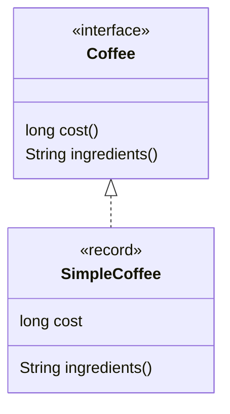
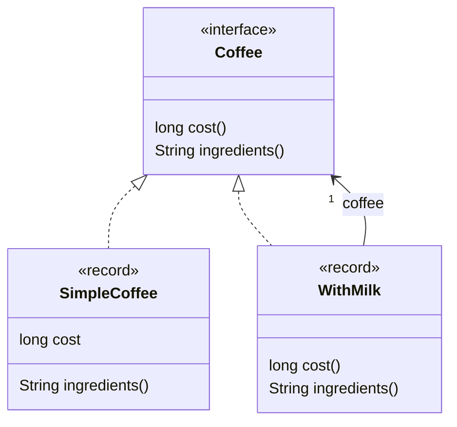

# The Decorator Pattern

A decorator is a simple way  to a dynamically enhance and existing behavior using composition.

Let say we have an interface `Coffee` that describe a Coffee by its cost and its ingredients 

```java
interface Coffee {
  long cost();      // cost of the coffee, in cents
  String ingredients();
}
```

We can write a simple implementation using a record.



```java
record SimpleCoffee(long cost) implements Coffee {
  @Override
  public String ingredients() {
    return "Coffee";
  }
}
```

Let say we now want to represent a coffee with milk, this is a `Coffee` so it should implement the interface
`Coffee`, it's cost is the cost of a simple coffee plus 50 cents and the ingredients is coffee and milk.

Because the behavior of a coffee with milk depends on the behavior of a coffee, a coffee with milk is created
using a coffee and delegates to that instance to get the cost of a coffee and the ingredient of a coffee.

```java
record WithMilk(Coffee coffee) implements Coffee {
  @Override
  public long cost() {
    return coffee.cost() + 50;
  }
  
  @Override
  public String ingredients() {
    return coffee.ingredients() + ", Milk";
  }
}
```



So `WithMilk` is simultaneously, a Coffee because it implements the interface `Coffee`and decorates an existing coffee
by taking an instance of a Coffee as record component.

If we repeat the pattern with `WithSprinkles`.

```java
record WithSprinkles(Coffee coffee) implements Coffee { 
  @Override
  public long cost() {
    return coffee.cost() + 20;
  }
  
  @Override
  public String ingredients() {
    return coffee.ingredients() + ", Sprinkles";
  }
}
```

We can see why this pattern is interesting because we have not only created a coffee with sprinkles but also
a coffee with milk and with sprinkles.

```java
Coffee coffee = new SimpleCoffee(100);
Coffee coffeeWithMilk = new WithMilk(coffee);
Coffee coffeeWithMilkAndSprinkles = new WithSprinkles(coffeeWithMilk);
System.out.println("ingredients: " + coffeeWithMilkAndSprinkles.ingredients());
System.out.println("cost: " + coffeeWithMilkAndSprinkles.cost() + " cents");
```

This pattern is more powerful than the inheritance because it relies on the delegation which is a dynamic relation
while the inheritance/extends is a static relation.


## Improving the API if the hierarchy is sealed

We can improve the API if we do not allow users to define their own coffee,
we can sealed the interface and provide instance methods (`withMilk`` and `withSprinkles` here)
to create a decorator from an existing instance more easily. 

```java
sealed interface Coffee permits SimpleCoffee, WithMilk, WithSprinkles {
  long cost();
  String ingredients();

  static Coffee simple(long cost) {
    return new SimpleCoffee(cost);
  }
  default Coffee withMilk() {
    return new WithMilk(this);
  }
  default Coffee withSprinkles() {
    return new WithSprinkles(this);
  }
}
```

Here is the same example as above, written using the new API

```java
Coffee coffeeWithMilkAndSprinkles = Coffee.simple(100)
    .withMilk()
    .withSprinkles();
System.out.println("ingredients: " + coffeeWithMilkAndSprinkles.ingredients());
System.out.println("cost: " + coffeeWithMilkAndSprinkles.cost() + " cents");
```

Apart from being easier in terms of method discovery, this API also does not explicitly reference the names
of the implementations so `SimpleCoffee`, `WithMilk` and `WithSprinkles` can be hidden and non-public.


## Relation with the Proxy Pattern

A proxy is a decorator with a different intent, it's the idea to intercept method calls to do cross-cutting operations
like logging, authentication, caching, etc.

Here is an example of a Coffee that logs its cost.

```java
record LoggingCoffee(Coffee coffee) {
  @Override
  public long cost() {
    var cost = coffee.cost();
    System.out.println("coffee cost " + cost);  // simulate logging
    return cost;
  }

  @Override
  public String ingredients() {
    return coffee.ingredients();
  }
}
```

