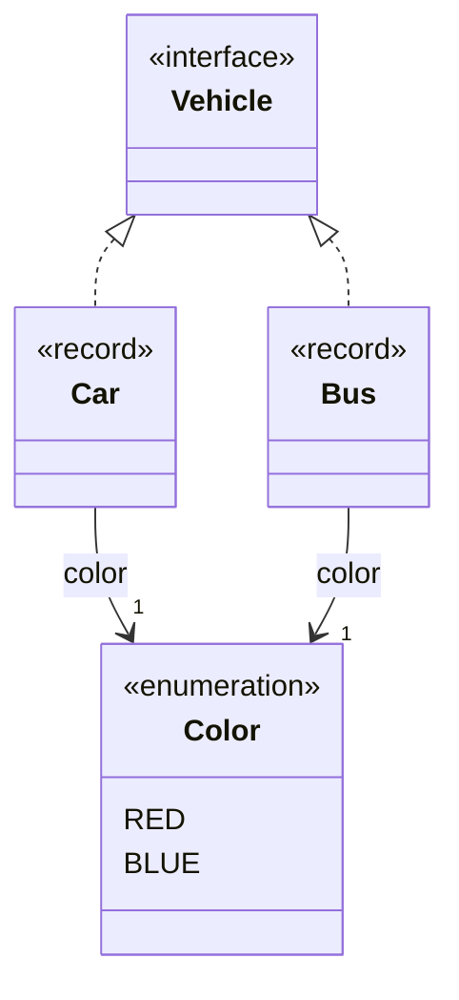
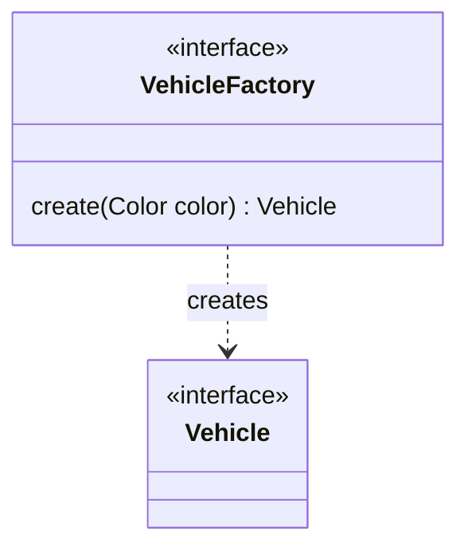

# Factory

A factory abstracts the creation of instances. Conceptually, it's a function that returns a different instances
each time the function is called.

Let's take an example, we have, at least, two kinds of `Vehicle` a `Car` and a `Bus` both takes a `Color` as parameter.



```java
enum Color { RED, BLUE }
interface Vehicle { }
record Car(Color color) implements Vehicle { }
record Bus(Color color) implements Vehicle { }
```

A factory let you use the same code to create instances of the same kind+color.
For example, if we want to create 5 vehicles, with a method `create5()` like this.

```java
static List<Vehicle> create5(Supplier<Vehicle> factory) {
  return Stream.generate(factory).limit(5).toList();
}
```

A Supplier is a predefined function interfac of Java that takes nothing and return an object.
We can then create 5 red cars that way. 

```java
Supplier<Vehicle> redCarFactory = () -> new Car(Color.RED);
System.out.println(create5(redCarFactory));
```

## A factory with parameters

A factory can also have parameters, in our example a color and we can specify that color
to create a vehicle with the right color.

```java
@FunctionalInterface
interface VehicleFactory {
  Vehicle create(Color color);

  default Supplier<Vehicle> bind(Color color) {
    return () -> create(color);
  }
}
```



Because `VehicleFactory` is a functional interface, it can be initialized that way to create cars.
```java
VehicleFactory carFactory = Car::new;
```

We can also [adapt](../adapter) the `VehicleFactory` to be seen as a supplier by providing the color.

```java
var supplier = carFactory.bind(Color.RED);
System.out.println(create5(supplier));
```
