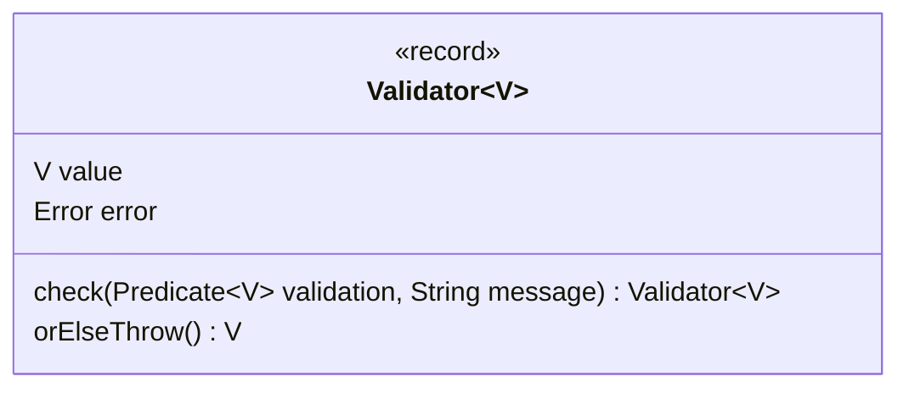

# Monad Pattern

A monad is a class that encapsulates several disjoint states.

Let say we have a `User` that comes from an untrusted source, by example, deserialized from a JSON request.
```java
record User(String name, int age) { }
```

We want to validate that none of the values of that object is illegal,
a simple solution is to write a method `validateUser` like this
```java
public static void validateUser(User user) {
  if (user.name().isEmpty()) {
    throw new IllegalArgumentException("name is empty");
  }
  if (!(user.age() > 0 && user.age() < 150)) {
    throw new IllegalArgumentException("age is not between 0 and 150");
  }
}
```

The problem with this solution is that if several values are illegal, only the first one is reported.
A solution is to delay the report of the errors, gathering all of them and at the end report of all them.
This requires to have an object that can store the value to validate (here a user) and all the error at
the same time.

## Enter the monad 

```java
record Error(IllegalArgumentException e, Error next) { }

record Validator<V>(V value, Error error) {
  public Validator<V> check(Predicate<? super V> validation, String message) {
    if (!validation.test(value)) {
      return new Validator<>(value, new Error(new IllegalArgumentException(message), error));
    }
    return this;
  }

  public V orElseThrow() throws IllegalStateException {
    if (error == null) {
      return value;
    }
    var exception = new IllegalStateException();
    Stream.iterate(error, Objects::nonNull, Error::next).map(Error::e).forEach(exception::addSuppressed);
    throw exception;
  }
}
```

A monad stores both the value and an error (here a linked list of exceptions).

It has two kind of methods
- intermediary operation, here `check(predicate, message)` that checks the value and return a new instance of monad
  with the states updated
- final operations that stop the processing, here `orElseThrow()` that returns the value or reports the exceptions.



With that `validateUser()` can be written that way
```java
public static User validateUser(User user) {
  return new Validator<>(user, null)
      .check(u -> !u.name().isEmpty(), "name is empty")
      .check(u -> u.age() >= 0 && u.age() <= 150, "age is not between 0 and 150")
      .orElseThrow();
}
```

## Improve the API by separating the accessor from the operation done on the accessor value

We can add an overloads to `check` that takes 2 parameters, a reference to an accessor method (like `User::name`) and
a predicate to cleanly express what test is done on what value.

```java
private static IntPredicate inBetween(int start, int end) {
  return value -> value >= start && value <= end;
}

public static User validateUser(User user) {
  return new Validator<>(user, null)
      .check(User::name, not(String::isEmpty), "name is empty")
      .check(User::age,  inBetween(0, 150)::test, "age is not between 0 and 150")
      .orElseThrow();
}
```

In that case, this method `check()` can be written using the function composition and delegate to
the method `check()` with one parameter.

```java
record Validator<V>(V value, Error error) {
  ...
  public <U> Validator<V> check(Function<? super V, ? extends U> projection, Predicate<? super U> validation, String message) {
    return check(projection.andThen(validation::test)::apply, message);
  }
  ...
}
```

The JDK contains two monads
[java.util.Optional](https://docs.oracle.com/en/java/javase/17/docs/api/java.base/java/util/Optional.html) and
[java.util.stream.Stream](https://docs.oracle.com/en/java/javase/17/docs/api/java.base/java/util/stream/Stream.html).
