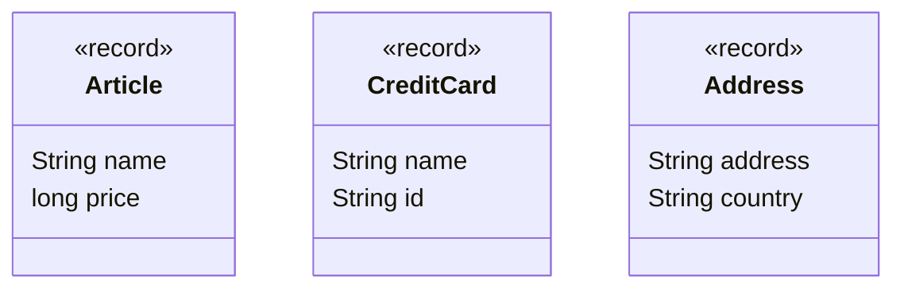
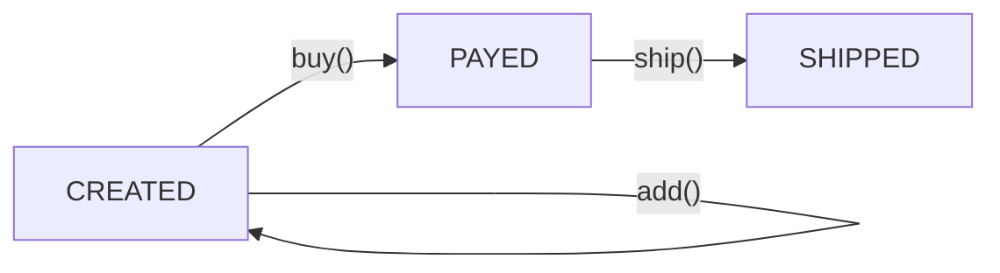
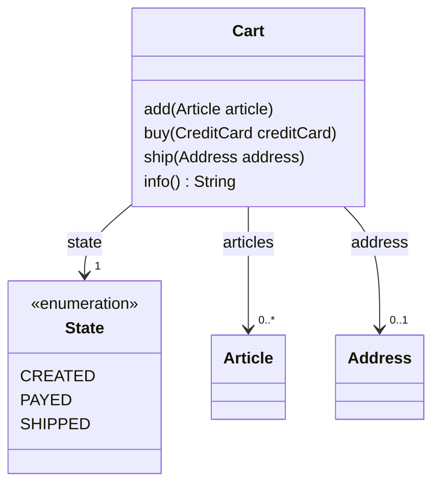
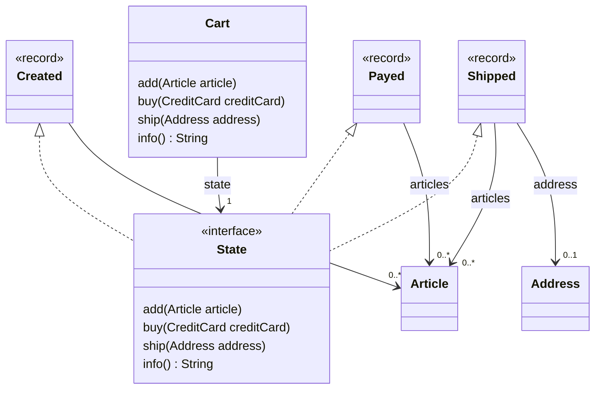

# The State Pattern

When you have a workflow and you move from one state to another,
it's often easier to read the code if each state is its own object.

Let say there is a cart, I can add article to it, then I will pay for all the articles in it then
I will ship the articles.



Here is an example of use (`info()` display the values of the state)
```java
var cart = new Cart();
cart.add(new Article("Lego Kit", 9999));
System.out.println(cart.info());
cart.buy(new CreditCard("Mr Nobody", "1212_2121_1212_2121"));
System.out.println(cart.info());
cart.ship(new Address("12 Nice Street, London", "England"));
System.out.println(cart.info());
```

Represented as an automata, there are 3 states, `CREATED`, `PAYED`, `SHIPPED` and
3 actions (transition) `add`, `buy` and `ship`.



## An implementation with an enum

One naive implementation is to use an enum to represent the different states



```java
class Cart {
  private enum State { CREATED, PAYED, SHIPPED }

  private List<Article> articles = new ArrayList<>();
  private Address address;
  private State state = State.CREATED;

  public void add(Article article) {
    if (state != State.CREATED) {
      throw new IllegalStateException();
    }
    articles.add(article);
  }

  public void buy(CreditCard creditCard) {
    if (state != State.CREATED) {
      throw new IllegalStateException();
    }
    state = State.PAYED;
    articles = List.copyOf(articles);
  }

  public void ship(Address address) {
    if (state != State.PAYED) {
      throw new IllegalStateException();
    }
    this.address = address;
    state = State.SHIPPED;
  }

  public String info() {
    return switch (state) {
      case CREATED -> "created articles " + articles;
      case PAYED -> "payed articles " + articles;
      case SHIPPED -> "shipped articles " + articles + " to " + address;
    };
  }
}
```

but it is not clear which values (`articles` and `address`) is available at which state 
and it makes all values mutable.


## An implementation with a hierarchy

The idea of the state pattern is that each state is represented by a different classes
and all transitions are represented by pure functions, the mutable part is dealt in `Cart`
by re-writing the field `state` so each implementation of the interface `State` can be immutable.



```java
class Cart {
  private sealed interface State {
    State add(Article article);
    State buy(CreditCard creditCard);
    State ship(Address address);
  }
  private record Created(ArrayList<Article> articles) implements State { ... }
  private record Payed(List<Article> articles) implements State { ... }
  private record Shipped(List<Article> articles, Address address) implements State { ... }

  private State state = new Created(new ArrayList<>());

  public void add(Article article) {
    state = state.add(article);
  }
  public void buy(CreditCard creditCard) {
    state = state.buy(creditCard);
  }
  public void ship(Address address) {
    state = state.ship(address);
  }
  public String info() {
    return state.toString();
  }
}
```

Instead of having to implement all methods, in all subtypes of `State`,
we provide an implementation by default that throw an exception.

```java
  private sealed interface State {
    default State add(Article article) {
      throw new IllegalStateException();
    }
    default State buy(CreditCard creditCard) {
      throw new IllegalStateException();
    }
    default State ship(Address address) {
      throw new IllegalStateException();
    }
  }
```

This is similar to adding a non-public abstract class in between the interface `State` and the implementations
if the implementations are classes. Here, we use records that do not support inheritance.

For the state `Created`, we have a transition `add()` that cycle back to the same state (so it returns `this`)
and a transition `buy()` that return a new state `Payed`. For `Payed`, we have a transition `ship()`
that returns a new state `Payed` which has no transition.

You can also remark that `Created` takes an `ArrayList` of articles because at that point it's a mutable structure
(and the record is declared `private` so there is no problem to expose the implementation). `Payed` and
`Shipped`, both takes an immutable list.

```java
  private record Created(ArrayList<Article> articles) implements State {
    @Override
    public State add(Article article) {
      articles.add(article);
      return this;
    }

    @Override
    public State buy(CreditCard creditCard) {
      return new Payed(List.copyOf(articles));
    }
  }
  private record Payed(List<Article> articles) implements State {
    @Override
    public State ship(Address address) {
      return new Shipped(articles, address);
    }
  }
  private record Shipped(List<Article> articles, Address address) implements State { }
```

The **State Pattern** splits the implementation on to each immutable state instead of having everything
mutable in `Cart`.
