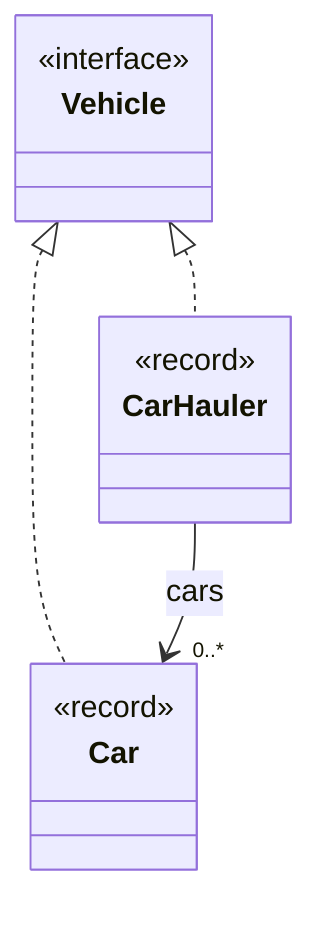
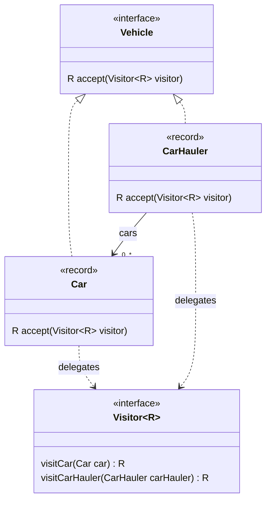

# The Visitor Pattern

The aim of Visitor Pattern is to be able to specify operations on a hierarchy of classes outside that hierarchy.

## Double dispatch

Let say we have the following closed/sealed hierarchy


```java
sealed interface Vehicle permits Car, CarHauler { }
record Car() implements Vehicle { }
record CarHauler(List<Car> cars) implements Vehicle {}
```

and we want to specify operation outside that hierarchy.
For that we need an interface and a method per concrete classes.
```java
interface Visitor<R> {
  R visitCar(Car car);
  R visitCarHauler(CarHauler carHauler);
}
```

then if we want by example count the number of cars, we can write the following visitor
```java
static int count(Vehicle vehicle) {
  var visitor = new Visitor<Integer>() {
    @Override 
    public Integer visitCar(Car car) {
      return 1;
    }
      
    @Override 
    public Integer visitCarHauler(CarHauler carHauler) {
      return 1 + carHauler.cars().stream().mapToInt(car -> car.accept(this)).sum();
    }
  };
  return vehicle.accept(visitor);
}
```

You can notice that we are using a mysterious method `accept()`. We can not directly call one of the methods
visit* of the interface `Visitor` with a `Vehicle` because we don't know witch one to call.
The method acts as a trampoline, when called on a vehicle with the visitor as parameter , it calls back
the right method of the `Visitor`.

So the hierarchy of vehicles needs to be modified to add the method `accept()`. 



```java
sealed interface Vehicle permits Car, CarHauler {
  <R> R accept(Visitor<? extends R> visitor);
}
record Car() implements Vehicle {
  @Override
  public <R> R accept(Visitor<? extends R> visitor) {
    return visitor.visitCar(this);
  }
}
record CarHauler(List<Car> cars) implements Vehicle {
  @Override
  public <R> R accept(Visitor<? extends R> visitor) {
    return visitor.visitCarHauler(this);
  }
}
```

This technique to call the method `accept` that will then call the right method `visit*` of the Visitor
is called the _double dispatch_ because effectively, there is one dynamic dispatch to call the right method accept
followed by another dynamic dispatch call through the Visitor interface.

The drawback of this design is that it requires the hierarchy to be modified to add the method `accept`
and only works on sealed hierarchy because you can not add new method in the `Visitor` interface.

The other issue is that because the visit is done outside the hierarchy, the class have to have accessor to
access the component values (the method `CarHauler.cars() in our example).


## Dynamic visitor with an open hierarchy

And what if we want the visitor to work on an open hierarchy ?
It means that we can not use an interface `Visitor` anymore, but you can replace it by as many functions
as methods of the interface.

In that case, `Visitor` becomes a class with a method `when` that associate for a class the function to call
(as a lambda) and a method `call` that for an instance of a `Vehicle` dynamically find its class and
calls the corresponding function.
```java
static int count(Vehicle vehicle) {
  var visitor = new Visitor<Integer>();
  visitor.when(Car.class, car -> 1)
         .when(CarHauler.class, carHauler -> 1 + carHauler.cars().stream().mapToInt(visitor::call).sum());
  return visitor.call(vehicle);
}
```

To do the association between a class and the corresponding visiting function,  we use a hash table
```java
public class Visitor<R> {
  private final HashMap<Class<?>, Function<Object, ? extends R>> map = new HashMap<>();
  
  public <T> Visitor<R> when(Class<? extends T> type, Function<? super T, ? extends R> fun) {
    map.put(type, fun.compose(type::cast));
    return this;
  }
    
  public R call(Object receiver) {
    var receiverClass = receiver.getClass();
    return map.computeIfAbsent(receiverClass, k -> { throw new IllegalArgumentException("invalid " + k.getName()); })
        .apply(receiver);
  }
}
```

You can notice that in order to compile, we need to see a function that take a subtype of `Vehicle`as a funtion
that takes an `Object`. This is done by done a dynamic cast (the method reference `type::cast`).


## Pattern matching

The visitor pattern is a way to a switch on a hierarchy of classes, starting with Java 17, as a preview feature
we can now do a switch on an interface.

```java
static int count(Vehicle vehicle) {
  return switch(vehicle) {
    case Car car -> 1;
    case CarHauler carHauler -> 1 + carHauler.cars().stream().mapToInt(car -> count(car)).sum());
  };
}
```

Like with the double dispatch, this requires the hierarchy to be sealed otherwise the compiler do not know
if the cases cover all possible subtypes.

In the future, Java will allow to access the components of the matched types without breaking the encapsulation
```java
static int count(Vehicle vehicle) {  /* provisional syntax */
  return switch(vehicle) {
    case Car _ -> 1;
    case CarHauler(var cars) -> 1 + cars.stream().mapToInt(car -> count(car)).sum());
  };
}
```
